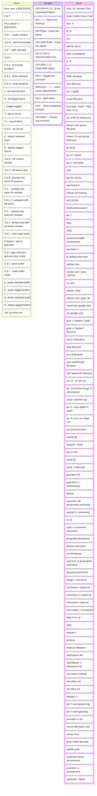

```mermaid
kanban
  tmux
    [tmux new -s $SESSION]
    [C-b ?]
    [tmux attach -t $SESSION]
    [C-b c : create window]
    [C-b % : split horizontally]
    [C-b " : split vertically]
    [C-b 0]
    [C-b q : print pane numbers]
    [C-b s : show sessions]
    [C-b w : show windows]
    [x : kill selected item]
    [X : kill tagged items]
    [t : toggle tagged]
    [T : tag no items]
    [C-t : tag all items]
    [C-b D : list clients]
    [d : detach selected client]
    [D : detach tagged clients]
    [C-b & : kill current window]
    [C-b x : kill active pane]
    [C-b $ : prompt new name for session]
    [C-b , : prompt new name for window]
    ["C-b { / }: swapped with the pane"]
    [C-b . : prompt new index for window]
    [C-b z : temporarily take up whole window]
    ["C-b [ : enter copy mode"]
    [C-Space : start a selection]
    [C-w : copy selection and exit copy mode]
    ["C-b ] : paste buffer"]
    [C-b = : enter buffer mode]
    [p : paste selected buffer]
    [P : paste tagged buffers]
    [d : delete selected buffer]
    [D : delete tagged buffers]
    [:set -g mouse on]
  vscode
    [Ctrl+Shift+P, F1 : Show Command Palette]
    [Alt+ ↓ / ↑ : Move line down/up]
    [Ctrl+Enter : Insert line below]
    [Ctrl+Shift+Enter : Insert line above]
    ["Ctrl+] / Ctrl+[ : Indent/Outdent line"]
    ["Ctrl+Shift+ [ / ] : Fold/unfold region"]
    [Ctrl+/ : Toggle line comment]
    [Shift+Ctrl+ ↑ / ↓ : Insert cursor above/below]
    [Ctrl+\ : Split editor]
    [Ctrl+` : Show integrated terminal]
    [Ctrl+Shift+` : Create new terminal]
  linux
    [who | w | whoami | last]
    [lscpu | lsblk | lscpu | lsof]
    [free -h]
    [df -h]
    [env]
    ["uptime [-p|-s]"]
    [date | timedatectl]
    [ls -lt]
    [cd -]
    [rmdir dirname]
    [less filename]
    [tail -f logfile]
    [locate filename]
    ["find /path -name ''*.log'' -exec rm {} \;"]
    [cp -p file.txt backup.txt]
    [chown user:group filename]
    [chown -R user:group directory/]
    ["ps [aux]"]
    [ps -ef --forest]
    [ps -u username]
    [jobs]
    ["bg %1 | fg %1"]
    [command &]
    [nohup command &]
    ["kill [-9] PID"]
    [killall processname]
    [kill -l]
    [htop]
    [iotop]
    [systemctl enable servicename]
    [journalctl -f]
    ["ip [addr|route] show"]
    [netstat -tuln]
    [netstat -tuln | grep LISTEN]
    [ss -tuln]
    [netstat -tulnp]
    [netstat -tuln | grep :80]
    [traceroute google.com]
    [mtr google.com]
    [grep -r "pattern" /path/]
    [grep -n "pattern" filename]
    ["sort [-n] filename"]
    [uniq filename]
    ["wc [-l] filename"]
    [sed 's/old/new/g' filename]
    [sed '/pattern/d' filename]
    [cut -d',' -f1 file.csv]
    [tar -xzf archive.tar.gz -C /destination/]
    [unzip -l archive.zip]
    [du -h --max-depth=1 /path/]
    [du -h | sort -hr | head -10]
    [cat /proc/meminfo]
    ["vmstat [2]"]
    [swapon --show]
    [top -p PID]
    ["iostat [2]"]
    [iostat -x /dev/sda]
    ["journalctl [-f]"]
    [journalctl -u servicename]
    [dmesg]
    [usermod -aG groupname username]
    ["userdel [-r username]"]
    ["su [-]"]
    [sudo -u username command]
    [groupadd groupname]
    [groups username]
    [cat /etc/group]
    [usermod -g groupname username]
    ["passwd [username]"]
    [chage -l username]
    [command > output.txt]
    [command >> output.txt]
    [command < input.txt]
    [command1 | command2]
    [alias ll='ls -la']
    [alias]
    [unalias ll]
    [printenv]
    [md5sum filename]
    [sha256sum file]
    [sha256sum -c checksums.txt]
    [ufw status verbose]
    [ufw allow ssh]
    [ufw deny 23]
    [iptables -L]
    [tail -f /var/log/auth.log]
    [tail -f /var/log/syslog]
    [journalctl -p err]
    [mount /dev/sda1 /mnt]
    [chroot /mnt]
    [grub-install /dev/sda]
    [update-grub]
    [systemctl status servicename]
    [journalctl -u servicename]
    [systemctl --failed]
```
